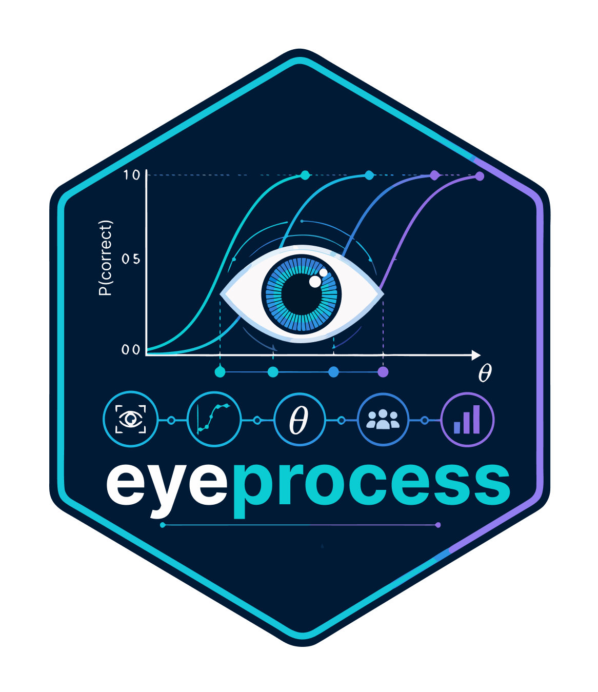

# eyeprocess 

**Vendor-neutral infrastructure for reproducible eye-tracking and multimodal process-data research.**

`eyeprocess` transforms heterogeneous eye-tracking, pupillometry, behavioural, and biometric exports into validated, analysis-ready process data. It combines vendor-neutral harmonization with first-class Gazepoint support, explicit quality and provenance controls, gaze/AOI/scanpath analysis, pupillometry and biometric workflows, interoperability, and psychometric/process modelling.

**Current formal release:** **0.11.1**

[Website](https://stefanosbalaskas.github.io/eyeprocess/) · [Reference](https://stefanosbalaskas.github.io/eyeprocess/reference/index.html) · [Articles](https://stefanosbalaskas.github.io/eyeprocess/articles/index.html) · [GitHub](https://github.com/stefanosbalaskas/eyeprocess) · [Releases](https://github.com/stefanosbalaskas/eyeprocess/releases)

## What eyeprocess provides

| Area | Capabilities |
| --- | --- |
| Import and harmonization | Vendor-aware readers, generic mappings, canonical schemas, explicit timebase and coordinate handling |
| Validation and provenance | Source inspection, schema coverage, quality audits, source fingerprints, validation corpora, provenance manifests |
| Gaze and AOI analysis | Trial construction, AOI registration and assignment, fixation summaries, scanpaths, transitions, visual diagnostics |
| Pupil and biometrics | Pupil preprocessing, binocular handling, physiological synchronization, quality-aware feature derivation |
| Process and psychometric modelling | IRT, response-time models, multimodal process measurement, validation and sensitivity infrastructure |
| Interoperability and storage | Eye-Tracking-BIDS, Arrow/Parquet workflows, conversion bridges, auditable storage contracts |

## September 2026 measurement-accountability additions

The current development branch adds three conservative diagnostics that make timing uncertainty and validation scope explicit without changing the package's existing synchronization or modelling engines:

- `pupil_latency_sensitivity()` compares sustained-threshold, maximum-slope-tangent, and piecewise-breakpoint pupil onsets and reports estimator spread, signal diagnostics, and latency resolvability instead of presenting one onset as hardware- or algorithm-independent.
- `event_marker_qc()` audits whether independent channel offsets corroborate a nominal event and reports consensus offset and uncertainty. It is event-plausibility QC only: it does **not** synchronize clocks, correct drift, or modify timestamps.
- `validation_ladder()` separates acquisition QC, analytical QC, construct checking, within-person evidence, and held-out-person generalization. A generalization claim cannot be marked supported without held-out-person validation.

See the [Measurement accountability article](https://stefanosbalaskas.github.io/eyeprocess/articles/measurement-accountability-0-11.html) and the [measurement-accountability reference section](https://stefanosbalaskas.github.io/eyeprocess/reference/index.html#measurement-accountability-diagnostics-0-11).

## Design commitments

- Harmonize semantics, not merely column names.
- Retain native timestamps and source files.
- Record every timebase and coordinate transformation.
- Keep vendor-produced and package-derived ocular events distinguishable.
- Never resample, interpolate, clip, reconstruct, or exclude observations silently.
- Treat gaze, pupil, and physiology as observations—not automatic psychological constructs.
- Keep Gazepoint support deep while the canonical representation remains vendor-neutral.

## Supported inputs

| Ecosystem | Initial interface | Support level |
| --- | --- | --- |
| Gazepoint Analysis | `read_gazepoint()`, `read_gazepoint_folder()` | First class |
| Gazepoint Biometrics | `read_gazepoint_biometrics()` | First class |
| Generic CSV/TSV | `read_eye_generic()` | Universal mapping |
| Tobii Pro Lab | `read_tobii()` | Dedicated |
| Pupil Labs Neon | `read_pupil_neon()` | Dedicated |
| Pupil Labs Core | `read_pupil_core()` | Dedicated |
| EyeLink ASC | `read_eyelink_asc()` | Dedicated |
| EyeLink Data Viewer | `read_eyelink_report()` | Explicit mapping |
| EyeLink EDF | `read_eyelink_edf()` | Local EDF2ASC bridge |
| SMI BeGaze ASCII | `read_smi()` | Legacy dedicated |
| Custom adapters | `register_eye_adapter()` | Extensible |

Support level and empirical validation are deliberately kept separate. The existence of an adapter is not treated as proof of production compatibility with every exporter or software version.

## Installation

Install the exact formal GitHub release:

```r
install.packages("remotes")
remotes::install_github("stefanosbalaskas/eyeprocess", ref = "v0.11.1")
```

For the current development branch:

```r
remotes::install_github("stefanosbalaskas/eyeprocess")
```

Optional modelling backends are deliberately not mandatory dependencies. Install only the engines required for a specific analysis.

## Quick start

```r
library(eyeprocess)

x <- read_gazepoint_folder(
  "data/P001",
  include = c("gaze", "fixations", "events", "biometrics")
)

validate_eye_dataset(x)
audit_timebase(x)
audit_signal_quality(x)

x <- build_trials(x, start_events = "TRIAL_START", end_events = "TRIAL_END")

x <- register_aois(
  x,
  new_aoi("prompt",  x = 0,    y = 0, width = 0.50, height = 1),
  new_aoi("options", x = 0.50, y = 0, width = 0.50, height = 1)
)

x <- assign_aois(x)
x <- derive_all_features(x)

plot_scanpath(x, trial_id = x$intervals$trial_id[1])
plot_pupil_timeseries(x, trial_id = x$intervals$trial_id[1])
```

For generic exports, Tobii, Pupil Labs, EyeLink, SMI, real-export validation, preprocessing, storage, and complete Gazepoint workflows, see the [articles](https://stefanosbalaskas.github.io/eyeprocess/articles/index.html).

## Process measurement and psychometrics

`eyeprocess` connects behavioural responses with process evidence while keeping measurement assumptions explicit. The multimodal measurement ladder is:

**M0 response → M1 + RT → M2 + gaze → M3 + pupil → M4 + trait-conditioned latent response-process state**

Examples of public interfaces include `fit_irt()`, `fit_explanatory_irt()`, `fit_accuracy_rt()`, `fit_process_irt()`, `multimodal_m3_spec()`, `fit_multimodal_m3()`, `multimodal_m4_spec()`, and `fit_multimodal_m4()`.

**M4 remains REVIEW / evidence-gated.** The availability of an estimator or model interface is not treated as evidence of unrestricted confirmatory validity. M4 states are model-based statistical response-process states; state labels do not by themselves establish cognitive strategy, attention, engagement, cognitive load, effort, emotion, guessing, misconduct, comprehension, or another psychological construct.

## Validation and reproducibility

The 0.11.1 release line preserves an auditable validation contract across data import, transformations, storage, modelling, and reporting. Release validation included the complete test suite and exact source-tarball checking with **0 errors and 0 warnings**; the remaining incoming NOTE concerns submission/optional repository metadata rather than a package failure.

The package also provides infrastructure for real-export validation, grouped validation, parameter recovery, simulation-based calibration, leakage checks, sensitivity analysis, model-evidence audits, benchmark generation, and reproducible reporting.

Detailed implementation and validation records are maintained in:

- [IMPLEMENTATION_STATUS.md](https://github.com/stefanosbalaskas/eyeprocess/blob/master/IMPLEMENTATION_STATUS.md)
- [FUNCTION_REFERENCE.md](https://github.com/stefanosbalaskas/eyeprocess/blob/master/FUNCTION_REFERENCE.md)
- [STATIC_AUDIT.txt](https://github.com/stefanosbalaskas/eyeprocess/blob/master/STATIC_AUDIT.txt)
- [VALIDATION_GAZEPOINT_7_2_0.md](https://github.com/stefanosbalaskas/eyeprocess/blob/master/VALIDATION_GAZEPOINT_7_2_0.md)

## Responsible interpretation

`eyeprocess` does not equate fixation with attention, dwell time with difficulty, pupil dilation with cognitive load, rapid response with guessing, physiological variation with a named mental state, or a data-derived process factor with a psychological construct.

Useful audit interfaces include:

```r
interpretive_warnings()
analysis_readiness(x)
provenance_manifest(x)
```

## Documentation

- [Getting started](https://stefanosbalaskas.github.io/eyeprocess/articles/getting-started.html)
- [Importing and harmonizing exports](https://stefanosbalaskas.github.io/eyeprocess/articles/importing-and-harmonizing.html)
- [Gazepoint workflows](https://stefanosbalaskas.github.io/eyeprocess/articles/gazepoint-workflows.html)
- [Validating real exports](https://stefanosbalaskas.github.io/eyeprocess/articles/validating-real-exports.html)
- [Preprocessing and features](https://stefanosbalaskas.github.io/eyeprocess/articles/preprocessing-features.html)
- [Psychometric process models](https://stefanosbalaskas.github.io/eyeprocess/articles/psychometric-process-models.html)
- [Measurement accountability](https://stefanosbalaskas.github.io/eyeprocess/articles/measurement-accountability-0-11.html)
- [Responsible use](https://stefanosbalaskas.github.io/eyeprocess/articles/responsible-use.html)
- [Complete function reference](https://stefanosbalaskas.github.io/eyeprocess/reference/index.html)

## Citation

For the citation associated with the installed package, run:

```r
citation("eyeprocess")
packageVersion("eyeprocess")
```

Studies should report the exact package version and, when relevant, the source commit and modelling backend used.

## Contributing and issues

- [Report an issue](https://github.com/stefanosbalaskas/eyeprocess/issues)
- [Contributing guide](https://github.com/stefanosbalaskas/eyeprocess/blob/master/CONTRIBUTING.md)
- [Code of conduct](https://github.com/stefanosbalaskas/eyeprocess/blob/master/CODE_OF_CONDUCT.md)

## License

MIT License.
