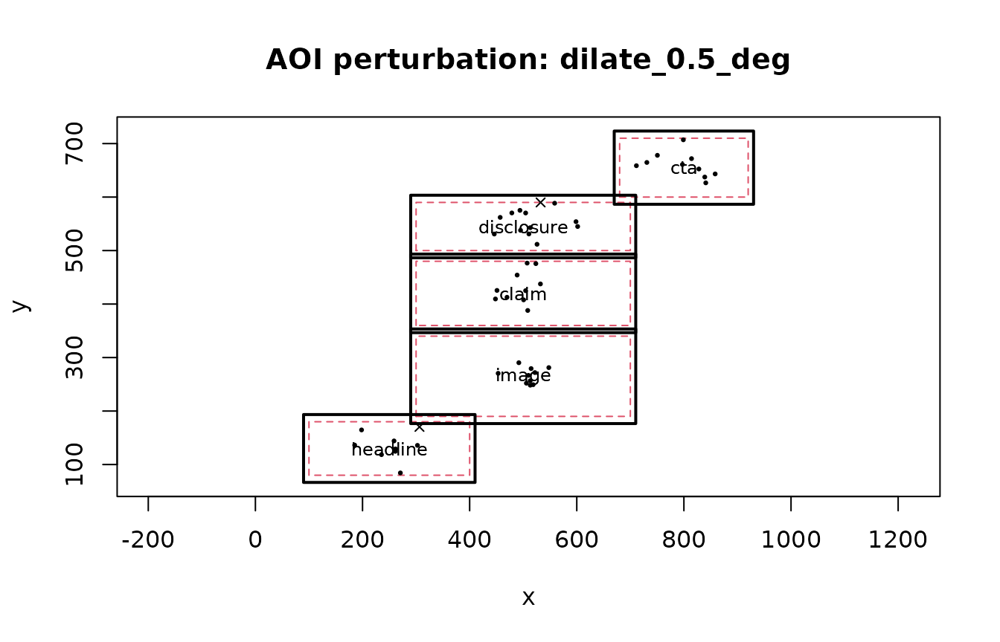

# AOI Perturbation and Uncertainty Analysis

## AOI Geometry Is an Analytical Assumption

AOI geometry is an analytical assumption. Small changes to a boundary
can change whether a sample or fixation is counted as headline, image,
claim, disclosure, CTA, outside, or ambiguous. The purpose of this
workflow is not to find a preferred boundary. It asks whether a
conclusion is stable under a declared set of defensible alternatives.

Use this analysis when observations cluster near boundaries, neighboring
AOIs are close, or AOI size is comparable with expected spatial error.
Do not use it as a substitute for calibration, coordinate-quality
auditing, or preregistered stimulus design.

## Synthetic advertising layout

The example is fully synthetic and intentionally small.

``` r

aois <- data.frame(
  aoi_id = c("headline", "image", "claim", "disclosure", "cta"),
  xmin = c(100, 300, 300, 300, 680),
  xmax = c(400, 700, 700, 700, 920),
  ymin = c(80, 190, 360, 500, 600),
  ymax = c(180, 340, 480, 590, 710)
)

set.seed(12)
centers <- data.frame(
  x = c(250, 500, 500, 500, 800),
  y = c(130, 270, 430, 560, 650),
  aoi = c("headline", "image", "claim", "disclosure", "cta")
)

rows <- list()
k <- 0L
for (participant in 1:8) {
  condition <- participant %% 2
  for (trial in 1:3) {
    for (j in seq_len(nrow(centers))) {
      n <- 5L + if (centers$aoi[j] == "disclosure" && condition == 1) 3L else 0L
      for (fix in seq_len(n)) {
        k <- k + 1L
        rows[[k]] <- data.frame(
          obs = k,
          participant = paste0("p", participant),
          trial = trial,
          condition = condition,
          x = rnorm(1, centers$x[j], 35),
          y = rnorm(1, centers$y[j], 22),
          duration = runif(1, .06, .18),
          time = j - 1 + (fix - 1) / 20
        )
      }
    }
  }
}
fixations <- do.call(rbind, rows)
```

## AOI Perturbation Sensitivity Analysis

### Pixels versus Degrees of Visual Angle

Degree-based perturbations require explicit display geometry and viewing
distance. The workflow never silently converts units.

``` r

grid <- create_aoi_perturbation_grid(
  dilations = c(.25, .50, 1.00),
  erosions = .25,
  translations_x = .50,
  translations_y = .50,
  unit = "deg",
  include_baseline = TRUE,
  screen_width_px = 1024,
  screen_height_px = 768,
  viewing_distance = 60,
  physical_screen_size = c(53.1, 29.9),
  boundary_policy = "allow"
)

grid$table
#>   perturbation_id operation margin_x margin_y translation_x translation_y unit
#> 1        baseline  baseline     0.00     0.00           0.0           0.0  deg
#> 2 dilate_0.25_deg  dilation     0.25     0.25           0.0           0.0  deg
#> 3  dilate_0.5_deg  dilation     0.50     0.50           0.0           0.0  deg
#> 4    dilate_1_deg  dilation     1.00     1.00           0.0           0.0  deg
#> 5  erode_0.25_deg   erosion     0.25     0.25           0.0           0.0  deg
#> 6 shift_x_0.5_deg translate     0.00     0.00           0.5           0.0  deg
#> 7 shift_y_0.5_deg translate     0.00     0.00           0.0           0.5  deg
#>   seed boundary_policy
#> 1   NA           allow
#> 2   NA           allow
#> 3   NA           allow
#> 4   NA           allow
#> 5   NA           allow
#> 6   NA           allow
#> 7   NA           allow
```

The seven branches are the nominal geometry, three dilations, one
erosion, one horizontal translation, and one vertical translation.

## Propagating AOI Uncertainty Into Statistical Models

The perturbation framework does not choose an estimator. The model
callback must explicitly report its estimator output, convergence flag,
and model `N`; converged rows require finite estimates, standard errors,
confidence limits, and a positive integer-valued `N`. Here the example
uses the same base-R linear model for disclosure dwell in every branch.

``` r

model_callback <- function(features, assigned, spec) {
  target <- features[features$aoi == "disclosure", , drop = FALSE]
  condition_map <- unique(assigned[, c("participant", "condition")])
  target <- merge(target, condition_map, by = "participant", all.x = TRUE)

  fit <- stats::lm(dwell ~ condition, data = target)
  co <- summary(fit)$coefficients
  if (!"condition" %in% rownames(co)) stop("condition coefficient unavailable")

  estimate <- unname(co["condition", "Estimate"])
  se <- unname(co["condition", "Std. Error"])

  data.frame(
    term = "condition",
    estimate = estimate,
    SE = se,
    CI_low = estimate - 1.96 * se,
    CI_high = estimate + 1.96 * se,
    p_value = unname(co["condition", "Pr(>|t|)"]),
    model_converged = TRUE,
    N = stats::nobs(fit)
  )
}
```

## Run geometry to inference

``` r

result <- run_aoi_sensitivity_analysis(
  fixations,
  aois,
  grid,
  x_col = "x",
  y_col = "y",
  observation_id_col = "obs",
  participant_col = "participant",
  trial_col = "trial",
  duration_col = "duration",
  time_col = "time",
  observation_level = "fixation",
  overlap_policy = "ambiguous",
  model_callback = model_callback,
  preprocessing_specification = list(duration_unit = "seconds"),
  event_detector = "synthetic_fixations",
  quality_rules = list(missing = "preserve", overlap = "ambiguous"),
  model_specification = list(
    family = "lm",
    outcome = "disclosure_dwell",
    predictor = "condition"
  )
)

summary <- summarise_aoi_sensitivity(result)
summary$assignment_stability
#>                 perturbation_id n_total n_comparable proportion_unchanged
#> baseline               baseline     636          636            1.0000000
#> dilate_0.25_deg dilate_0.25_deg     636          636            0.9827044
#> dilate_0.5_deg   dilate_0.5_deg     636          636            0.9748428
#> dilate_1_deg       dilate_1_deg     636          636            0.9591195
#> erode_0.25_deg   erode_0.25_deg     636          636            0.9811321
#> shift_x_0.5_deg shift_x_0.5_deg     636          636            1.0000000
#> shift_y_0.5_deg shift_y_0.5_deg     636          636            0.9559748
#>                 proportion_newly_assigned proportion_lost proportion_reassigned
#> baseline                       0.00000000      0.00000000           0.000000000
#> dilate_0.25_deg                0.01729560      0.00000000           0.000000000
#> dilate_0.5_deg                 0.02515723      0.00000000           0.000000000
#> dilate_1_deg                   0.03144654      0.00000000           0.009433962
#> erode_0.25_deg                 0.00000000      0.01886792           0.000000000
#> shift_x_0.5_deg                0.00000000      0.00000000           0.000000000
#> shift_y_0.5_deg                0.01886792      0.02515723           0.000000000
summary$inference_stability
#>                term n_models n_converged convergence_proportion
#> condition condition        7           7                      1
#>           same_sign_proportion median_estimate min_estimate max_estimate
#> condition                    1       0.3151472    0.2942975    0.3198195
#>           median_CI_width median_N min_N max_N
#> condition       0.2268699       24    24    24
```

## Interpreting AOI Assignment Stability

The assignment table distinguishes unchanged observations, newly
assigned observations, lost assignments, AOI-to-AOI reassignment,
missing comparisons, and explicit overlap ambiguity. Missing coordinates
are not converted to outside-AOI observations.

### Fixation and sample input

The same geometry and assignment engine supports fixation-centroid and
sample-level input. Declare `observation_level = "fixation"` or
`"sample"`. Output always contains universal observation counts/timing;
fixation-specific fields are populated only for fixation input and
sample counts only for sample input. This prevents sample rows from
being reported as fixation counts.

### Zero is not missing

Feature recomputation preserves the complete declared AOI universe
within each observed participant/trial group. A zero `observation_count`
means valid observations were available but none were assigned to that
AOI; `fixation_count` or `sample_count` is populated only at the
matching observation level. If a group has no valid AOI assignment
opportunity, counts and inspection remain missing rather than being
coerced to zero. Missing assigned durations make dwell missing, and
first-observation timing is never inferred from row order.

## Visual diagnostics

``` r

plot_aoi_perturbations(
  result,
  perturbation_id = "dilate_0.5_deg",
  data = fixations[seq(1, nrow(fixations), by = 12), ],
  x_col = "x",
  y_col = "y"
)
```



``` r

plot_aoi_assignment_stability(result)
```


``` r

plot_aoi_coefficient_stability(result, "condition")
```


### Plot-to-question map

| Visual | Function | Scientific question | Report with |
|----|----|----|----|
| Perturbed geometry | [`plot_aoi_perturbations()`](https://stefanosbalaskas.github.io/eyeprocess/reference/aoi_perturbation_uncertainty.md) | Which observations cross a boundary when geometry changes? | perturbation ID, units, overlap/boundary policy |
| Assignment stability | [`plot_aoi_assignment_stability()`](https://stefanosbalaskas.github.io/eyeprocess/reference/aoi_perturbation_uncertainty.md) | How much of the measurement mapping changes? | unchanged/new/lost/reassigned proportions |
| Coefficient stability | [`plot_aoi_coefficient_stability()`](https://stefanosbalaskas.github.io/eyeprocess/reference/aoi_perturbation_uncertainty.md) | Does the same model change materially? | coefficient/interval range, convergence, model `N` |
| Robustness surface | [`plot_aoi_robustness_surface()`](https://stefanosbalaskas.github.io/eyeprocess/reference/aoi_perturbation_uncertainty.md) | Where does sensitivity concentrate across two-dimensional perturbations? | both perturbation axes and the plotted stability metric |

The robustness-surface plot is most useful when the analysis plan
includes a two-dimensional perturbation grid. Do not construct a surface
after seeing results merely to locate a favorable region.

``` r

surface_pairs <- as.matrix(expand.grid(
  margin_x = c(-.25, 0, .25, .50),
  margin_y = c(-.25, 0, .25, .50)
))
surface_grid <- create_aoi_perturbation_grid(
  anisotropic = surface_pairs,
  unit = "deg",
  include_baseline = TRUE,
  screen_width_px = 1024,
  screen_height_px = 768,
  viewing_distance = 60,
  physical_screen_size = c(53.1, 29.9),
  boundary_policy = "allow"
)
surface_result <- run_aoi_sensitivity_analysis(
  fixations, aois, surface_grid,
  x_col = "x", y_col = "y",
  observation_id_col = "obs",
  participant_col = "participant",
  trial_col = "trial",
  duration_col = "duration",
  time_col = "time",
  observation_level = "fixation"
)
plot_aoi_robustness_surface(surface_result)
```

The coefficient plot should be interpreted together with the assignment
plot. A result can have many reassigned fixations without reversing a
coefficient, or can show high aggregate assignment stability while a
model estimate remains sensitive.

## Demonstrate a failure branch

Excessive erosion is retained as a failed branch rather than
disappearing.

``` r

failure_grid <- create_aoi_perturbation_grid(erosions = 500)
failure_result <- apply_aoi_perturbation_grid(aois, failure_grid)
failure_result$audit
#>   perturbation_id    status
#> 1        baseline completed
#> 2    erode_500_px    failed
#>                                                 message geometry_hash
#> 1                                                  <NA>     25689-662
#> 2 Perturbation `erode_500_px` collapsed AOI `headline`.          <NA>
```

Model callbacks follow the same rule: an error is written to the failure
table, and a row with `model_converged = FALSE` remains visible rather
than being treated as a valid estimate.

## AOI Robustness Decision Clinic

Interpret assignment and model stability together rather than treating
one metric as a verdict.

| Pattern | Interpretation | Recommended response |
|----|----|----|
| High assignment stability + stable coefficient | Stable within the declared envelope | Report the envelope and stability summaries; do not call this proof that the nominal AOI is correct |
| Low assignment stability + stable coefficient | Mapping changes but the model-level result is insensitive | Report reassignment matrices and model stability together |
| High assignment stability + unstable coefficient | A small subset of groups or observations may be influential | Inspect participant/trial/AOI summaries, intervals, convergence, and model `N` |
| Low assignment stability + unstable coefficient | The substantive result depends materially on AOI geometry | Describe the nominal result as geometry-sensitive |
| Failed branches | Part of the planned sensitivity design is non-evaluable | Retain failures and explain them; never shrink the denominator silently |

Choose perturbation magnitudes from acquisition precision, display
geometry, stimulus layout, or a preregistered rationale. Do not search
for the margin that restores statistical significance.

### Reporting example

> We reran AOI assignment, feature extraction, and the prespecified
> model across the nominal geometry and defensible perturbations. We
> report reassignment patterns, coefficient ranges and intervals,
> convergence, and model-N variation. Failed branches remain in the
> audit trail. Stability frequencies describe robustness to the declared
> perturbation set and are not probabilities that the scientific
> conclusion is true.

## Planning the sensitivity analysis before results

For a fillable preregistration-style template and API mapping, see the
companion **AOI Sensitivity Analysis Plan and Reporting Template**
article.

Record the AOI sensitivity plan before examining branch-specific model
results. At minimum, state:

1.  the nominal AOI source and geometry representation;
2.  whether rows are samples or fixations;
3.  the perturbation operations and exact values;
4.  pixel or degree units and the display/viewing geometry when degrees
    are used;
5.  overlap and screen-boundary policies;
6.  the fixed statistical model specification;
7.  how failed geometry, callback errors, and non-convergence will be
    retained and reported.

Do not widen, shrink, or selectively edit the perturbation grid because
a particular branch changes statistical significance.

## Troubleshooting AOI perturbation branches

Diagnose the earliest failing layer first: **geometry -\> assignment -\>
feature recomputation -\> model callback**.

| Symptom | Inspect | Interpretation |
|----|----|----|
| Perturbation status is `failed` | `result$grid_result$audit` | Geometry could not be evaluated; keep the branch in the planned denominator |
| Many `__ambiguous__` assignments | perturbed AOIs and reassignment matrix | AOIs overlap under that perturbation; do not silently choose one |
| Many `__outside__` assignments | units, coordinate transform, AOI location | Layout/assignment mismatch, not automatically zero exposure |
| Count is zero | valid-observation denominator | Valid observations existed but none entered that AOI |
| Count is missing | missing-coordinate denominator | No valid assignment opportunity existed; do not coerce to zero |
| Callback failure | `result$failures` | Model branch is non-evaluable, not a valid null result |
| `model_converged = FALSE` | model table and estimator diagnostics | Retain the row but exclude it from converged-effect summaries |
| Model `N` changes | inference stability table | Case loss varies across branches and must be reported |

A compact audit pattern is:

``` r

result$grid_result$audit[, c("perturbation_id", "status", "message")]
result$failures
result$models[, c("perturbation_id", "term", "model_converged", "N")]
assess_aoi_inference_stability(result, term = "condition")
```

The package does not reinterpret a geometry failure as a model result, a
callback exception as non-significance, or missing assignment
opportunity as a structural zero.

### Reporting problematic branches

> Of the planned AOI perturbations, all non-evaluable geometry and model
> branches were retained in the audit trail. Overlap ambiguity remained
> explicit, missing assignment opportunities were not converted to zero,
> and non-converged model rows were excluded from converged-effect
> summaries. Model-N variation was reported alongside coefficient and
> assignment stability.

This is a reporting template, not an empirical result.

### Figure set for manuscripts and reviewer responses

A compact evidence set usually contains: (1) one geometry/reassignment
figure, (2) assignment stability, and (3) coefficient stability. Add the
two-dimensional robustness surface only when joint geometry changes are
part of the prespecified sensitivity plan. Pair the figures with the
branch audit, failure table, convergence summary, and model-`N` range
rather than presenting plots without denominators.

## Reporting AOI Robustness

For manuscript supplements, reviewer responses, or replication handoff,
see the companion **AOI Robustness Reporting Bundle** article for a
recommended file set, export pattern, privacy guidance, and API map.

``` r

cat(report_aoi_sensitivity(result))
#> ## AOI perturbation sensitivity analysis
#> 
#> Planned perturbations: 7; completed geometry branches: 7; geometry failures: 0; model callback failures: 0.
#> Median unchanged AOI assignment across completed perturbations: 0.981.
#> 
#> Model-level sensitivity is summarized by coefficient direction, magnitude, interval width, and convergence rather than significance alone.
#> - condition: 7/7 converged; same-sign frequency=1.000; median estimate=0.3151; range=[0.2943, 0.3198]; N range=[24, 24].
#> 
#> Interpretation: these quantities describe robustness to the declared AOI perturbations. They are not probabilities that the scientific conclusion is true.
```

A manuscript should report the nominal AOI source, coordinate system,
observation level, perturbation operations and values,
pixel-versus-degree units, screen geometry and viewing distance when
degrees are used, overlap policy, screen-boundary policy, random seed
for jitter, assignment denominators, recomputed features, model
specification, coefficient/interval ranges, convergence, model-`N`
variation, and handling of failed or non-converged branches.

Robustness frequencies are descriptive summaries conditional on the
declared perturbation set. They are **not probabilities that the
scientific conclusion is true**.

## R/Python Scientific Parity

The R and Python implementations share the same perturbation IDs,
outside and ambiguous labels, missing-coordinate semantics, unit
requirements, failure records, model-convergence handling, and
interpretation caveat. Both ship the same frozen two-AOI parity fixture.

Parity is semantic rather than byte-for-byte numerical identity. Base-R
and NumPy random-number generators are allowed to produce different
jitter coordinates from the same integer seed, provided each
implementation is deterministic for its own seed and records that seed.
Plot objects are also language-native: base R graphics in `eyeprocess`
and Matplotlib axes in `eyeprocesspy`.

User-supplied model callbacks may use different statistical backends, so
exact coefficient equality is not required unless the same estimator and
numerical backend are deliberately used.

## Limitations

- Geometry perturbation does not replace calibration-error analysis.
- It does not replace event-detector sensitivity analysis.
- Exact concave-polygon buffering requires a dedicated geometry engine;
  the dependency-free core rejects concave dilation/erosion rather than
  silently approximating it.
- Degree conversion inherits uncertainty in screen dimensions and
  viewing distance.
- The perturbation envelope must be scientifically defensible; wider
  grids do not automatically provide stronger evidence.

## API map

Use
[`create_aoi_perturbation_grid()`](https://stefanosbalaskas.github.io/eyeprocess/reference/aoi_perturbation_uncertainty.md)
to declare branches,
[`run_aoi_sensitivity_analysis()`](https://stefanosbalaskas.github.io/eyeprocess/reference/aoi_perturbation_uncertainty.md)
for the complete workflow,
[`estimate_aoi_assignment_stability()`](https://stefanosbalaskas.github.io/eyeprocess/reference/aoi_perturbation_uncertainty.md)
for assignment robustness,
[`assess_aoi_inference_stability()`](https://stefanosbalaskas.github.io/eyeprocess/reference/aoi_perturbation_uncertainty.md)
for coefficient/convergence/model-`N` summaries, and
[`report_aoi_sensitivity()`](https://stefanosbalaskas.github.io/eyeprocess/reference/aoi_perturbation_uncertainty.md)
for a compact reporting draft.
