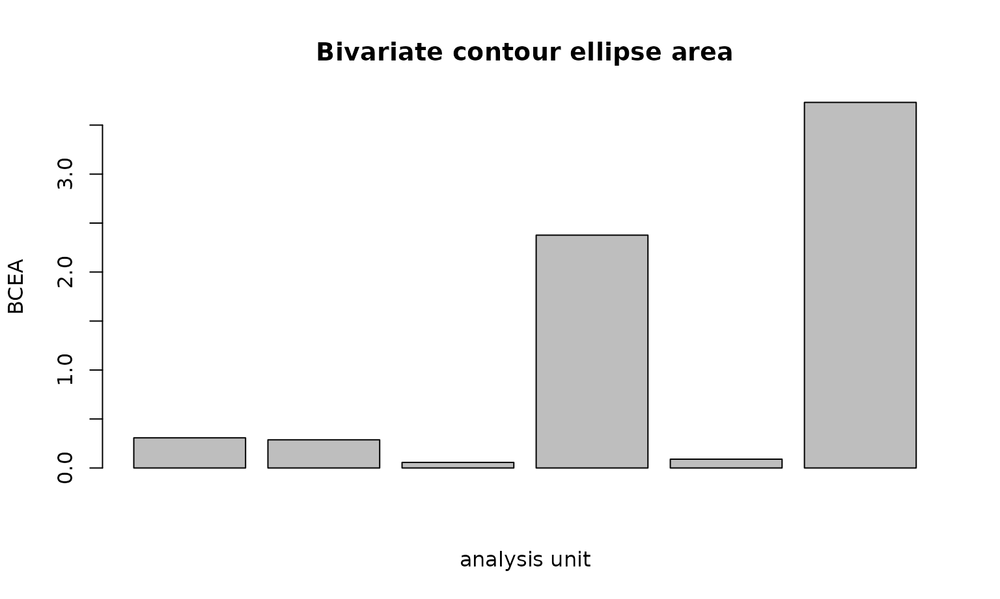
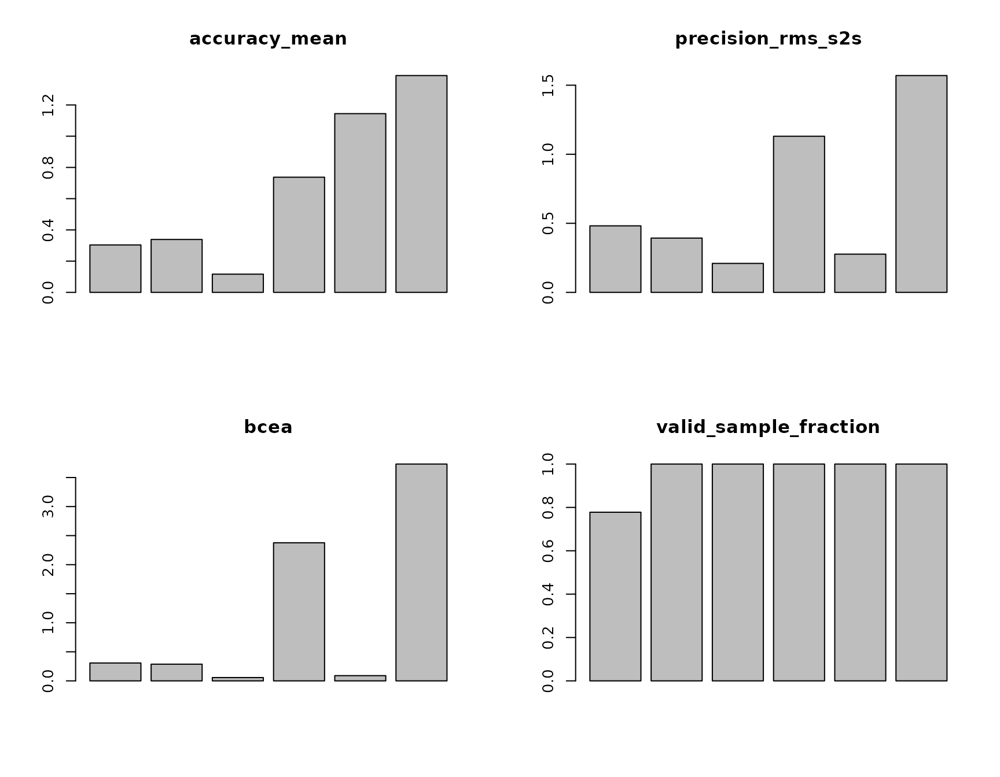

# Data Quality plot gallery and reporting clinic

``` r

library(eyeprocess)
#> eyeprocess 0.12.0: vendor-neutral eye/process data harmonization with first-class Gazepoint support.
```

## Purpose

This gallery complements the main standardized data-quality guide with
visual, manuscript-facing examples. It uses deterministic synthetic
validation data, not empirical performance claims.

``` r

validation <- simulate_gaze_quality_calibration(
  seed = 20260918,
  samples_per_target = 18,
  nominal_sampling_hz = 60
)

quality <- create_gaze_quality_report(
  validation,
  by = c("profile", "target_id"),
  valid = "valid",
  missing_reason = "missing_reason",
  nominal_sampling_hz = 60,
  bcea_probability = 0.68,
  preprocessing_spec = "synthetic raw validation samples; no interpolation",
  quality_rules = "descriptive review only"
)

center_target <- quality[quality$target_id == 5, ]
```

## Accuracy

``` r

plot_gaze_accuracy(center_target)
```


Higher target-referenced error means recorded gaze is farther from the
known target. Accuracy is not precision: a stable offset can be precise
but inaccurate.

## RMS sample-to-sample precision

``` r

plot_gaze_precision(center_target)
```


RMS-S2S describes successive-sample fluctuation during stable gaze. Do
not calculate or interpret it across target changes or intended
saccades. The implementation never bridges a missing sample.

## BCEA

``` r

plot_bcea(center_target)
```



BCEA summarizes spatial dispersion as an area. The probability level
must be reported; the canonical default is 0.68. BCEA is not a
target-referenced accuracy statistic.

## Sampling intervals

``` r

irregular <- validation[
  validation$profile == "irregular_sampling" &
    validation$target_id == 5,
]
plot_sampling_intervals(irregular, time = "timestamp_ms", time_unit = "ms")
```


Long intervals describe realized timebase irregularity. When a nominal
rate is supplied, `long_interval_count` records anomalously long
intervals and `dropped_interval_count` estimates how many nominal
samples those gaps represent. Neither quantity is a direct hardware
packet-loss measurement.

## Four-panel quality dashboard

``` r

plot_gaze_quality_dashboard(center_target)
```



The dashboard is a descriptive review surface. It is not a composite
score and does not make exclusion decisions.

## Review-rule sensitivity

``` r

reviewed <- create_gaze_quality_report(
  validation,
  by = c("profile", "target_id"),
  valid = "valid",
  missing_reason = "missing_reason",
  nominal_sampling_hz = 60,
  thresholds = list(
    accuracy_mean = list(max = 1.0),
    valid_sample_fraction = list(min = 0.80)
  )
)

table(reviewed$review_required)
#> 
#> FALSE  TRUE 
#>    25    29
attr(reviewed, "gaze_quality_provenance")$automatic_exclusion
#> [1] FALSE
```

Thresholds are study-specific review rules. They do not silently drop
trials, participants, or files. A defensible analysis reports the
primary rule and then checks whether conclusions change under plausible
alternatives.

## Reporting checklist

A manuscript should report, where relevant:

1.  coordinate unit and any screen/viewing geometry used for conversion;
2.  validation/check-target procedure and grouping level;
3.  target-referenced accuracy statistic;
4.  exact precision definition (RMS-S2S, SD, and/or BCEA);
5.  BCEA probability when used;
6.  nominal and empirically realized sampling behavior;
7.  operational definition and amount of data loss;
8.  review/exclusion thresholds and numbers affected;
9.  sensitivity analyses when substantive conclusions depend on quality
    choices.

A compact starting point is:

``` r

report_gaze_quality(center_target)
#> [1] "accuracy_mean: mean 0.671, range 0.116-1.388; precision_rms_s2s: mean 0.677, range 0.210-1.570; precision_sd: mean 0.466, range 0.126-1.087; bcea: mean 1.142, range 0.057-3.732; effective_sampling_hz: mean 56.278, range 46.667-60.000; valid_sample_fraction: mean 0.963, range 0.778-1.000; data_loss_fraction: mean 0.037, range 0.000-0.222. Review required for 0/6 analysis units. Thresholds, when supplied, are study-specific review rules and never trigger automatic exclusion."
```

## API links

- [`compute_gaze_accuracy()`](https://stefanosbalaskas.github.io/eyeprocess/reference/standardized_spatial_quality.md)
- [`compute_rms_s2s()`](https://stefanosbalaskas.github.io/eyeprocess/reference/standardized_spatial_quality.md)
- [`compute_gaze_sd_precision()`](https://stefanosbalaskas.github.io/eyeprocess/reference/standardized_spatial_quality.md)
- [`compute_bcea()`](https://stefanosbalaskas.github.io/eyeprocess/reference/standardized_spatial_quality.md)
- [`estimate_sampling_interval()`](https://stefanosbalaskas.github.io/eyeprocess/reference/standardized_spatial_quality.md)
- [`estimate_sampling_jitter()`](https://stefanosbalaskas.github.io/eyeprocess/reference/standardized_spatial_quality.md)
- [`estimate_effective_sampling_rate()`](https://stefanosbalaskas.github.io/eyeprocess/reference/standardized_spatial_quality.md)
- [`compute_gaze_data_loss()`](https://stefanosbalaskas.github.io/eyeprocess/reference/standardized_spatial_quality.md)
- [`create_gaze_quality_report()`](https://stefanosbalaskas.github.io/eyeprocess/reference/standardized_spatial_quality.md)
- [`plot_gaze_accuracy()`](https://stefanosbalaskas.github.io/eyeprocess/reference/standardized_spatial_quality.md)
- [`plot_gaze_precision()`](https://stefanosbalaskas.github.io/eyeprocess/reference/standardized_spatial_quality.md)
- [`plot_bcea()`](https://stefanosbalaskas.github.io/eyeprocess/reference/standardized_spatial_quality.md)
- [`plot_sampling_intervals()`](https://stefanosbalaskas.github.io/eyeprocess/reference/standardized_spatial_quality.md)
- [`plot_gaze_quality_dashboard()`](https://stefanosbalaskas.github.io/eyeprocess/reference/standardized_spatial_quality.md)
- [`report_gaze_quality()`](https://stefanosbalaskas.github.io/eyeprocess/reference/standardized_spatial_quality.md)

## Limitations

These functions characterize the measurement process. They do not
establish attention, engagement, cognitive load, motivation, competence,
or clinical status. Synthetic examples demonstrate software behavior;
they are not tracker benchmarks and do not define universal exclusion
thresholds.
