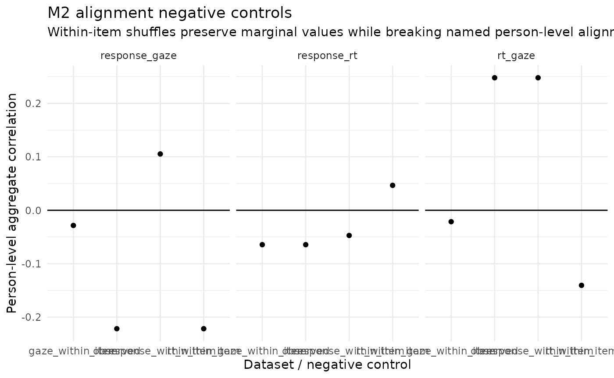

# M2 Posterior Predictive Checks and Negative Controls

## Channel-specific model checks

The three-way reference literature evaluates response, response-time,
and fixation-count components separately using W, L, and M discrepancy
statistics.
[`multimodal_m2_ppc()`](https://stefanosbalaskas.github.io/eyeprocess/reference/multimodal_m2_ppc.md)
implements the same channel-specific logic as posterior predictive item
checks.

``` r

library(eyeprocess)

sim <- simulate_multimodal_m2(
  n_person = 120,
  n_item = 12,
  seed = 55
)

fit <- fit_multimodal_m2(sim, seed = 56)

ppc <- multimodal_m2_ppc(fit)
ppc
plot(ppc)
```

Posterior predictive p-values are model-data diagnostics. They are not
proof that the latent gaze dimension is a validated psychological
construct.

## Alignment negative controls

Negative controls ask whether apparent multimodal information depends on
meaningful person-level alignment rather than only channel marginals.

``` r

library(eyeprocess)
#> eyeprocess 0.11.0.9000: vendor-neutral eye/process data harmonization with first-class Gazepoint support.

sim <- simulate_multimodal_m2(
  n_person = 80,
  n_item = 10,
  seed = 77
)

nc <- multimodal_m2_negative_controls(
  sim,
  seed = 78
)

nc
#> <eye_multimodal_m2_negative_controls>
#>   controls: gaze_within_item, rt_within_item, response_within_item
#>   seed: 78
#>   boundary: Negative controls test whether apparent incremental process information depends on person-level channel alignment. They do not identify a causal mechanism or label participant behavior.
head(nc$provenance)
#>                control changed_channel
#> 1     gaze_within_item            gaze
#> 2       rt_within_item              rt
#> 3 response_within_item        response
#>                                                      preserved
#> 1 within-item marginal observed values and missingness pattern
#> 2 within-item marginal observed values and missingness pattern
#> 3 within-item marginal observed values and missingness pattern
#>                                         broken
#> 1 person-level alignment for the named channel
#> 2 person-level alignment for the named channel
#> 3 person-level alignment for the named channel
#>                                                      interpretation
#> 1 falsification control; not causal and not a misconduct classifier
#> 2 falsification control; not causal and not a misconduct classifier
#> 3 falsification control; not causal and not a misconduct classifier
plot(nc)
#> Warning: Use of `d[["dataset"]]` is discouraged.
#> ℹ Use `.data[["dataset"]]` instead.
#> Warning: Use of `d[["correlation"]]` is discouraged.
#> ℹ Use `.data[["correlation"]]` instead.
#> Warning: Use of `d[["pair"]]` is discouraged.
#> ℹ Use `.data[["pair"]]` instead.
```



The controls permute gaze, RT, or response **within item**. This
preserves each item’s observed marginal values and missingness pattern
while breaking the named person-level alignment.

These are falsification controls, not causal interventions and not
misconduct classifiers.
