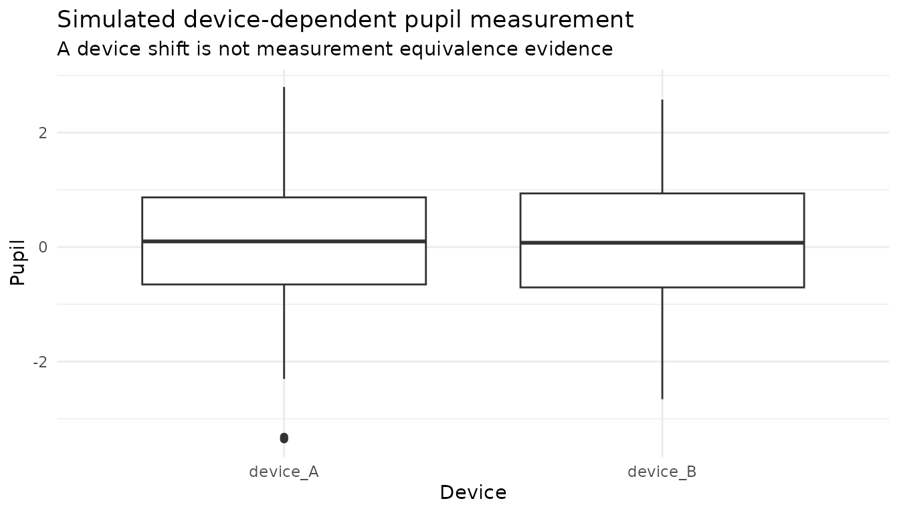
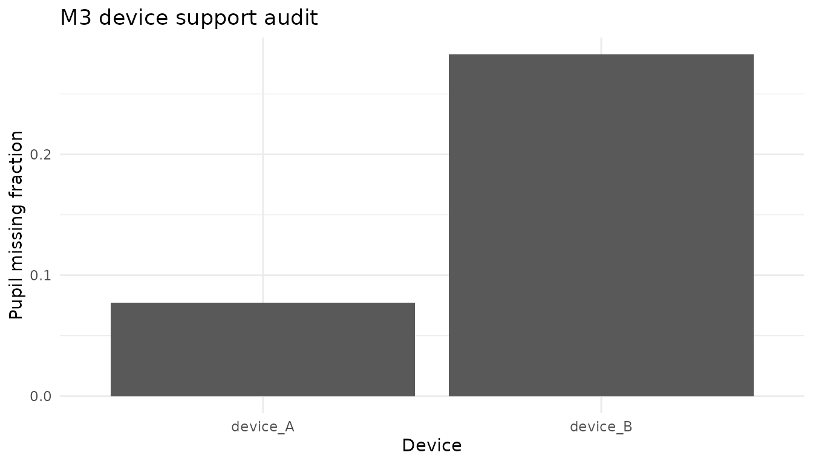
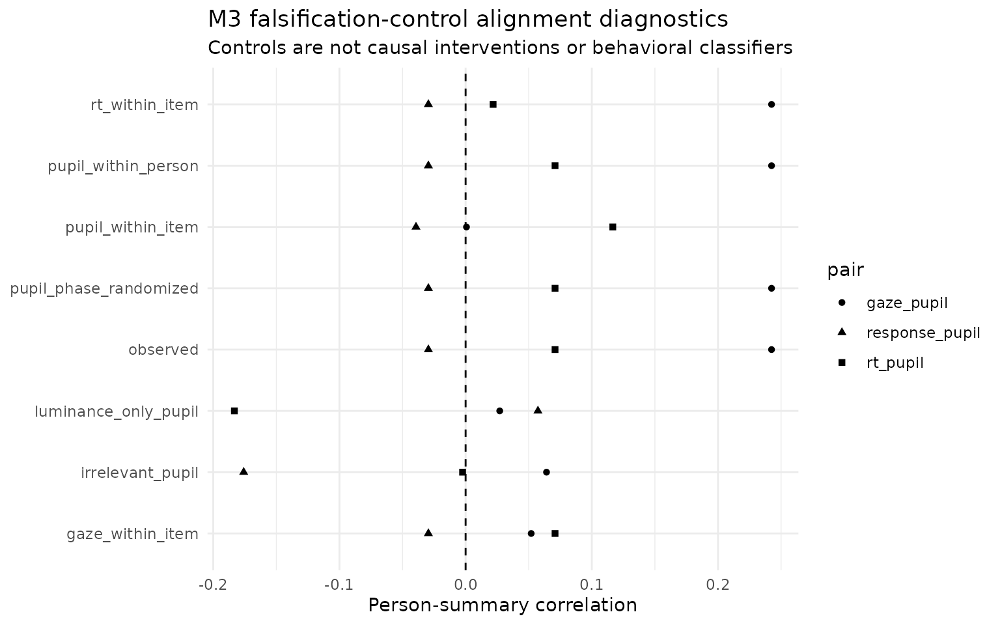

# M3 device transport, falsification controls, and sensor value

## More sensors can create more failure modes

Pupil measurements can vary with device, sampling rate, gaze geometry,
missingness and preprocessing. A four-channel model therefore needs
falsification and transport diagnostics in addition to a richer
likelihood. M3 exposes those concerns without asserting that a device
label itself explains measurement differences.

## Device-dependent stress

``` r

sim <- simulate_multimodal_m3(
  n_person = 80,
  n_item = 10,
  pupil_missingness = "device",
  seed = 20260815
)

audit <- audit_multimodal_m3_identifiability(sim)
audit$device
#>            device   n pupil_missing pupil_mean
#> device_A device_A 400        0.0775 0.10029058
#> device_B device_B 400        0.2825 0.07845766
```

``` r

plot(sim, type = "device")
#> Warning: Removed 144 rows containing non-finite outside the scale range
#> (`stat_boxplot()`).
```



``` r

plot(audit, type = "device")
```



These outputs identify device-specific shifts or availability patterns
in the simulation. They do not establish measurement invariance.
Empirical device transport requires repeated-device or appropriately
linked data, explicit equivalence/invariance analysis and validation of
the underlying pupil units and preprocessing semantics.

## Falsification controls

``` r

neg <- multimodal_m3_negative_controls(sim, seed = 20260816)
neg$provenance
#>                  control
#> 1       gaze_within_item
#> 2         rt_within_item
#> 3      pupil_within_item
#> 4    pupil_within_person
#> 5 pupil_phase_randomized
#> 6   luminance_only_pupil
#> 7       irrelevant_pupil
#>                                                                                                 purpose
#> 1                                                               break gaze-person alignment within item
#> 2                                                                 break RT-person alignment within item
#> 3                                                              break pupil-person alignment within item
#> 4                                                              break pupil-item alignment within person
#> 5 destroy within-person ordered pupil-series phase structure while retaining its spectrum approximately
#> 6                                                 test measurement artefact masquerading as pupil value
#> 7                                                          test irrelevant channel false-positive value
#>                                                              interpretation
#> 1 falsification diagnostic only; not causal and not a behavioral classifier
#> 2 falsification diagnostic only; not causal and not a behavioral classifier
#> 3 falsification diagnostic only; not causal and not a behavioral classifier
#> 4 falsification diagnostic only; not causal and not a behavioral classifier
#> 5 falsification diagnostic only; not causal and not a behavioral classifier
#> 6 falsification diagnostic only; not causal and not a behavioral classifier
#> 7 falsification diagnostic only; not causal and not a behavioral classifier
```

M3 includes pupil permutations within item and within person, phase
randomization, a luminance-only pseudo-pupil, and an irrelevant
synthetic pupil channel. These deliberately break different aspects of
person/item alignment. They are tests of whether the analysis pipeline
is too willing to manufacture process value; they are not causal
interventions and not participant-behavior or misconduct detectors.

``` r

plot(neg, type = "pupil_alignment")
```



## Sensor value is conditional

After an ablation lattice has been fitted,
[`multimodal_m3_process_information()`](https://stefanosbalaskas.github.io/eyeprocess/reference/multimodal_m3_process_information.md)
reports the response-target pupil gain per usable pupil observation and
per analyst-supplied relative sensor cost. This can support design
discussions about whether a pupil channel is worth collecting under a
specific model and target.

``` r

ab <- multimodal_m3_ablation(sim, chains = 4, parallel_chains = 4)
info <- multimodal_m3_process_information(ab, pupil_cost = 1.5)
info$sensor_value
plot(info, type = "sensor_value")
```

The calculation is intentionally labeled a **sensor value-of-information
screen**, not an economic cost-effectiveness analysis. It does not
account automatically for equipment depreciation, staff time,
participant burden, calibration failures, or the value of non-response
outcomes.

## Channel conflict

The same information object places response ELPD beside convergence
diagnostics. This makes a useful failure mode visible: a channel can
look incrementally predictive while substantially worsening
computational stability, or can sharpen latent estimates without
improving held-out response prediction. M3 keeps those dimensions
separate so that a single improvement cannot hide a meaningful
trade-off.
