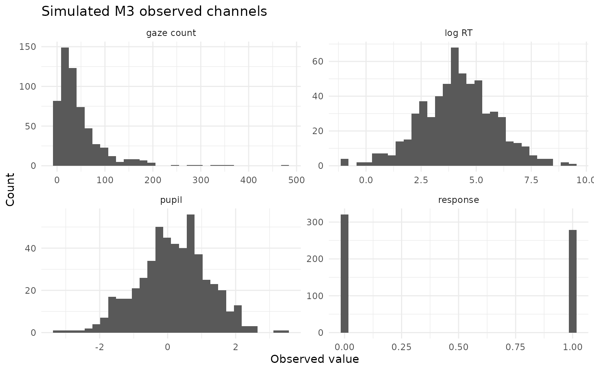
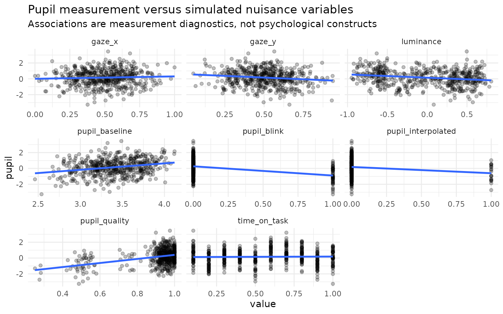

# M3: Four-channel response, RT, gaze, and pupil measurement

## Purpose

M3 extends the frozen M2 response + response-time + fixation-count
reference model with a fourth **pupil measurement channel**. The
extension is deliberately neutral: pupil responsivity is a model
dimension, not an automatic proxy for cognitive load, effort, arousal,
attention, or strategy. The purpose is to ask whether a pupil
measurement contributes additional response-target information after the
response, RT, and gaze channels have already been represented.

For person `j` and item `i`, M3 uses four correlated person effects
(ability, speed, gaze-process propensity, pupil responsivity) and four
correlated item location effects (difficulty, time intensity, gaze
intensity, pupil intensity). The observation layer is Rasch response,
lognormal RT, negative-binomial fixation count, and Gaussian pupil
summary. Pupil nuisance terms are included explicitly for baseline,
luminance, gaze X/Y, measurement quality, blink status, interpolation
status, and time-on-task when those variables are available.

The correlation structures are fitted through Cholesky factors with LKJ
priors. This is computational parameterization, not a claim that the
four process dimensions are psychological constructs.

## Simulate and audit before fitting

``` r

sim <- simulate_multimodal_m3(
  n_person = 60,
  n_item = 10,
  seed = 20260815
)

audit <- audit_multimodal_m3_identifiability(sim)
print(audit)
#> <eye_multimodal_m3_identifiability>
#>   persons: 60
#>   items: 10
#>   supported: TRUE
#>   warning-free: TRUE
#>   missing: response=0.000, rt=0.000, gaze=0.040, pupil=0.140
#>   pupil blink/interpolation: 0.110 / 0.048
#>   boundary: This is a conservative structural/data-support audit. Passing does not establish global identifiability, empirical construct validity, or robustness to informative pupil/gaze missingness, device artefacts, or unmeasured luminance.
```

The audit checks channel presence, variation, bipartite design
connectivity, pupil missingness, nuisance availability,
blink/interpolation burden, and the explicit scale constraints used by
the model. Passing is a prerequisite for fitting; it is not proof of
global identifiability.

``` r

plot(sim, type = "channels")
```



``` r

plot(sim, type = "pupil_confounds")
#> `geom_smooth()` using formula = 'y ~ x'
```



## Fit with CmdStanR

The reference estimator is gated because it requires a working
CmdStanR/CmdStan toolchain and because scientific promotion requires
recovery, PPC, missingness, negative-control, and empirical evidence
beyond successful sampling.

``` r

fit <- fit_multimodal_m3(
  sim,
  chains = 4,
  parallel_chains = 4,
  iter_warmup = 1000,
  iter_sampling = 1000,
  adapt_delta = 0.95,
  seed = 20260815,
  init = 0
)

summary(fit)
validate_multimodal_m3(fit)
plot(fit, type = "person_correlations")
plot(fit, type = "pupil_nuisance")
```

M3 does not silently substitute another backend. Missing observed values
are omitted under the current explicit *ignorable missingness*
likelihood;
[`simulate_multimodal_m3()`](https://stefanosbalaskas.github.io/eyeprocess/reference/simulate_multimodal_m3.md)
and
[`multimodal_m3_recovery()`](https://stefanosbalaskas.github.io/eyeprocess/reference/multimodal_m3_recovery.md)
provide stress scenarios for violations of that assumption.

## Relationship to M0-M2

The M0-M3 sequence remains cumulative conceptually, but M3 analysis is
not restricted to a single nested path.
[`multimodal_m3_ablation()`](https://stefanosbalaskas.github.io/eyeprocess/reference/multimodal_m3_ablation.md)
fits all eight response-anchored combinations of RT, gaze and pupil,
allowing pupil to be evaluated alone, after RT, after gaze, and after
both. This is necessary because correlated channels can be redundant or
conditionally complementary.

## Evidence boundary

M3 is a measurement framework. A positive pupil coefficient, latent
correlation, ELPD gain, or posterior-variance reduction is not by itself
evidence for a cognitive mechanism. Conversely, a scientifically useful
M3 result may be that pupil contributes no clear incremental
response-target information after nuisance adjustment and the other
process channels.
