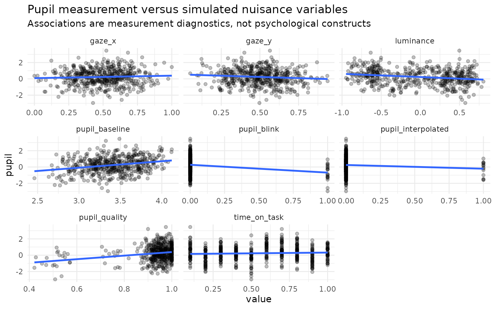
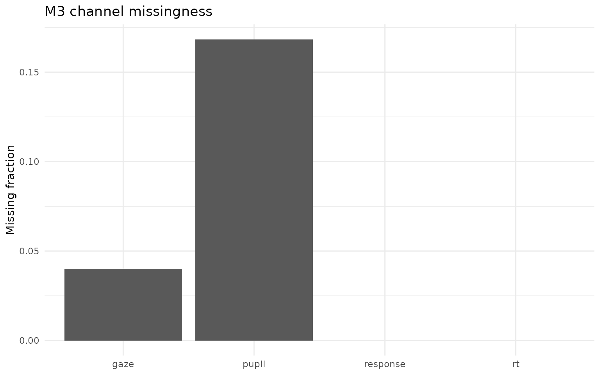
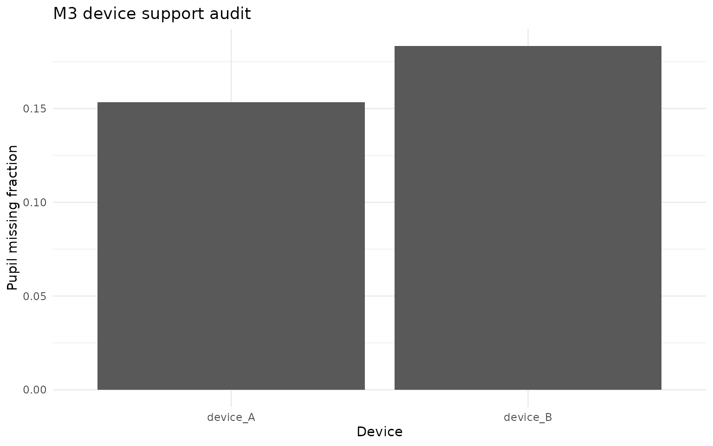

# M3 pupil measurement: confounds, quality, and missingness

## Pupil is a measurement, not a label

Pupil size depends on more than the process an analyst hopes to study.
M3 therefore treats baseline pupil, luminance, gaze X/Y, measurement
quality, blink status, interpolation status and time-on-task as
**measurement variables**. The model does not rename residual pupil
variation as cognitive load. This distinction is central to the 0.10
architecture.

The reference preprocessing literature also motivates conservative
handling. Mathôt et al. (2018; DOI 10.3758/s13428-017-1007-2) show that
invalid baseline values caused by blinks or data loss can distort
baseline correction. Gagl et al. (2011; DOI 10.3758/s13428-011-0109-5)
document systematic gaze-position effects on measured pupil size. M3
therefore records nuisance availability and refuses to silently impute a
nuisance variable that was explicitly supplied but is missing on an
observed-pupil trial.

## Inspect the contract

``` r

sim <- simulate_multimodal_m3(
  n_person = 60,
  n_item = 10,
  pupil_missingness = "quality",
  seed = 20260815
)

audit <- audit_multimodal_m3_identifiability(sim)
audit$pupil$nuisance
#>                 covariate available degenerate      center     scale
#> baseline         baseline      TRUE      FALSE  3.40116829 0.3185509
#> luminance       luminance      TRUE      FALSE -0.01942274 0.4958308
#> gaze_x             gaze_x      TRUE      FALSE  0.50079275 0.1782709
#> gaze_y             gaze_y      TRUE      FALSE  0.50576483 0.1581575
#> quality           quality      TRUE      FALSE  0.89758913 0.1550746
#> blink               blink      TRUE      FALSE  0.11000000 0.3131508
#> interpolated interpolated      TRUE      FALSE  0.04833333 0.2146486
#> time_on_task time_on_task      TRUE      FALSE  0.55000000 0.2874678
```

``` r

plot(sim, type = "pupil_confounds")
#> `geom_smooth()` using formula = 'y ~ x'
```



``` r

plot(audit, type = "missingness")
```



``` r

plot(audit, type = "device")
```



The nuisance variables are standardized over observed pupil rows. A
degenerate nuisance variable is recorded and disabled rather than given
an unstable coefficient. If an expected nuisance is completely absent,
M3 records it as unavailable; absence is not treated as evidence that
the confound was controlled.

## Missingness stress is part of the model evidence

The fitted reference likelihood is currently ignorable with respect to
channel missingness. This is a declared limitation. Simulation supports
several pupil dropout mechanisms:

``` r

mechanisms <- c("mcar", "quality", "gaze", "ability", "device")
missing <- vapply(mechanisms, function(m) {
  z <- simulate_multimodal_m3(
    n_person = 40,
    n_item = 8,
    pupil_missingness = m,
    seed = 100 + match(m, mechanisms)
  )
  mean(is.na(z$data$pupil))
}, numeric(1))
missing
#>     mcar  quality     gaze  ability   device 
#> 0.156250 0.159375 0.168750 0.175000 0.178125
```

`quality` creates dropout related to pupil quality, `gaze` links pupil
availability to the gaze process, `ability` creates a deliberately
non-ignorable person-side stress case, and `device` creates differential
channel availability across devices. These are sensitivity designs, not
claims that a particular empirical dataset follows one mechanism.

## Device and session effects

The simulation also retains device, session and sampling-rate metadata.
The first summary-level likelihood does not automatically estimate
arbitrary device equivalence. Device-specific shifts and dropout are
used to test whether the pupil dimension remains stable under transport
stress. A later empirical validation programme should use
repeated-device or calibration data before making invariance claims.

## Practical rule

A pupil channel should be considered defensible only when its
measurement provenance is inspectable, its nuisance variables and
missingness are audited, its contribution survives falsification
controls, and the inferential result remains appropriately conditional
on those assumptions.
