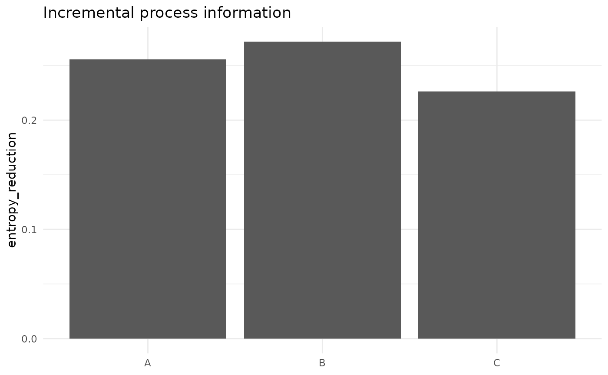

# Process Information and Channel Ablation

## Posterior uncertainty as measurement value

[`process_information()`](https://stefanosbalaskas.github.io/eyeprocess/reference/process_information.md)
compares matched posterior targets without assuming that heterogeneous
Fisher information components can simply be added.

``` r

set.seed(10)
base <- matrix(rnorm(6000, sd=1), ncol=3)
aug  <- matrix(rnorm(6000, sd=.8), ncol=3)
colnames(base) <- colnames(aug) <- c("A","B","C")
info <- process_information(base, aug, metric="entropy_reduction")
info
#> <eye_process_information>
#>  target            metric     value baseline_variance augmented_variance
#>       A entropy_reduction 0.2557330          1.036352          0.6214131
#>       B entropy_reduction 0.2717227          1.055327          0.6128745
#>       C entropy_reduction 0.2260618          1.037273          0.6599914
#>  relative_variance_reduction
#>                    0.4003841
#>                    0.4192561
#>                    0.3637245
plot(info)
#> Warning: Use of `d[["target"]]` is discouraged.
#> ℹ Use `.data[["target"]]` instead.
#> Warning: Use of `d[["value"]]` is discouraged.
#> ℹ Use `.data[["value"]]` instead.
```



## Channel ablation

``` r

sim <- simulate_multimodal_irt(n_person=50,n_item=8,seed=5)
abl <- ablate_multimodal_channels(sim$measurement)
names(abl$scenarios)
#> [1] "response"               "response+rt"            "response+gaze"         
#> [4] "response+pupil"         "response+rt+gaze"       "response+rt+pupil"     
#> [7] "response+gaze+pupil"    "response+rt+gaze+pupil"
```

Ablation is an inferential comparison design, not automatically a causal
counterfactual.
