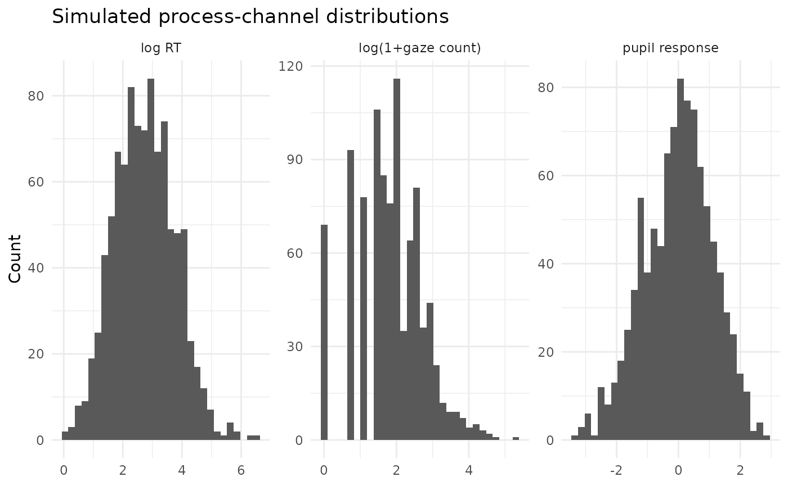

# Pupil Measurement Boundaries in Multimodal IRT

## Why pupil needs a measurement layer

The 0.10 development simulator explicitly separates a neutral pupil
responsivity dimension from nuisance effects of luminance and gaze
position.

``` r

sim <- simulate_multimodal_irt(
  n_person=80, n_item=12, seed=21,
  pupil_luminance=-.25,
  gaze_x_effect=.10,
  gaze_y_effect=-.06
)
summary(sim$data[c("pupil_response","luminance_z","gaze_x_z","gaze_y_z")])
#>  pupil_response      luminance_z           gaze_x_z         
#>  Min.   :-3.35320   Min.   :-3.312172   Min.   :-3.8822895  
#>  1st Qu.:-0.76977   1st Qu.:-0.601877   1st Qu.:-0.6557865  
#>  Median : 0.05232   Median : 0.017611   Median : 0.0136808  
#>  Mean   :-0.01175   Mean   : 0.007727   Mean   : 0.0009432  
#>  3rd Qu.: 0.77131   3rd Qu.: 0.677612   3rd Qu.: 0.6890059  
#>  Max.   : 2.85091   Max.   : 3.185114   Max.   : 3.2321063  
#>     gaze_y_z        
#>  Min.   :-3.140749  
#>  1st Qu.:-0.667967  
#>  Median :-0.044002  
#>  Mean   :-0.004006  
#>  3rd Qu.: 0.640364  
#>  Max.   : 2.692336
```

``` r

plot(sim, type="channel_distributions")
#> Warning: Use of `long[["value"]]` is discouraged.
#> ℹ Use `.data[["value"]]` instead.
```



The presence of a pupil effect does not establish cognitive load,
effort, or arousal.
