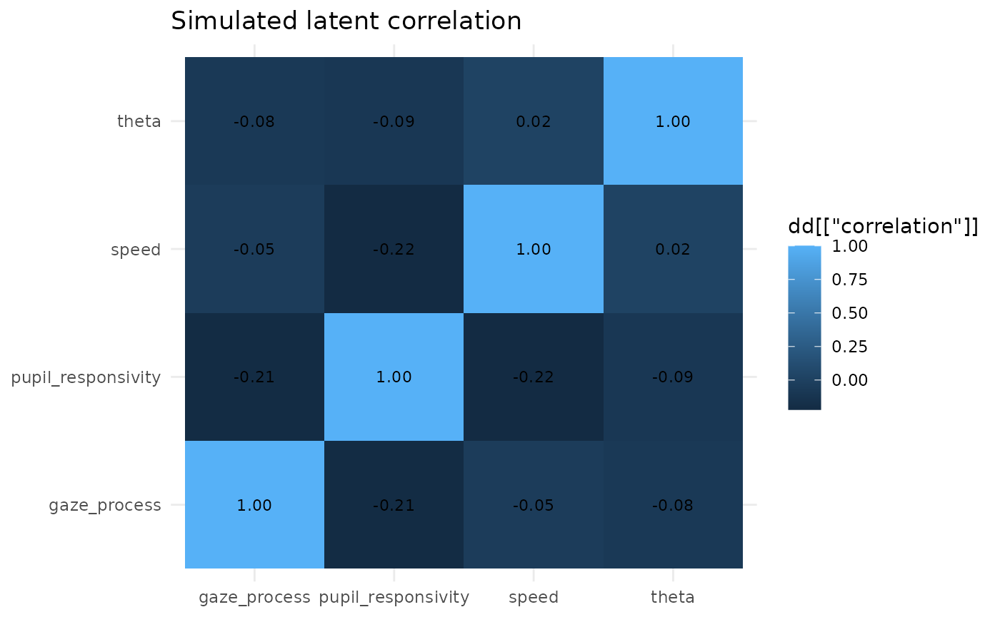
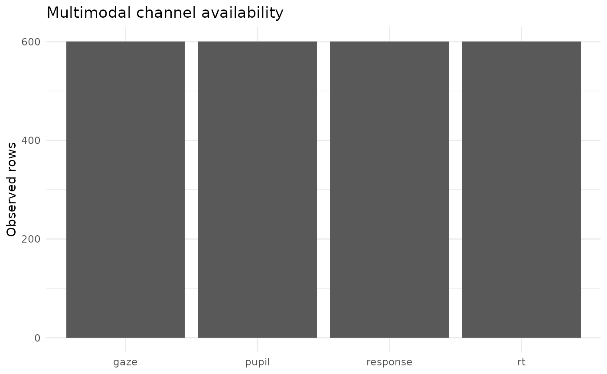

# Unified Multimodal Process-IRT

## Objective

`eyeprocess` 0.10 treats response, RT, gaze and pupil as coordinated
measurement channels while retaining neutral interpretation of process
signals.

``` r

sim <- simulate_multimodal_irt(n_person=60, n_item=10, seed=42)
sim
#> <eye_multimodal_simulation>
#>  observations : 600 
#>  persons      : 60 
#>  items        : 10 
#>  seed         : 42
audit_multimodal_measurement(sim$measurement)
#> <eye_multimodal_audit>
#>  valid  : TRUE 
#>  issues : none 
#>   channel              column   n observed missing missing_fraction
#>  response            response 600      600       0                0
#>        rt                  rt 600      600       0                0
#>      gaze gaze_fixation_count 600      600       0                0
#>     pupil      pupil_response 600      600       0                0
#>  finite_fraction
#>                1
#>                1
#>                1
#>                1
```

## Native visualization

``` r

plot(sim, type="latent_correlation")
#> Warning: Use of `dd[["dimension_1"]]` is discouraged.
#> ℹ Use `.data[["dimension_1"]]` instead.
#> Warning: Use of `dd[["dimension_2"]]` is discouraged.
#> ℹ Use `.data[["dimension_2"]]` instead.
#> Warning: Use of `dd[["correlation"]]` is discouraged.
#> ℹ Use `.data[["correlation"]]` instead.
#> Use of `dd[["correlation"]]` is discouraged.
#> ℹ Use `.data[["correlation"]]` instead.
#> Warning: Use of `dd[["dimension_1"]]` is discouraged.
#> ℹ Use `.data[["dimension_1"]]` instead.
#> Warning: Use of `dd[["dimension_2"]]` is discouraged.
#> ℹ Use `.data[["dimension_2"]]` instead.
#> Warning: Use of `dd[["correlation"]]` is discouraged.
#> ℹ Use `.data[["correlation"]]` instead.
```



``` r

plot(sim$measurement, type="availability")
#> Warning: Use of `d[["channel"]]` is discouraged.
#> ℹ Use `.data[["channel"]]` instead.
#> Warning: Use of `d[["value"]]` is discouraged.
#> ℹ Use `.data[["value"]]` instead.
```



## Interpretation boundary

The simulated gaze dimension is a gaze-process propensity and the pupil
dimension is pupil responsivity. Neither is automatically a
psychological construct.
